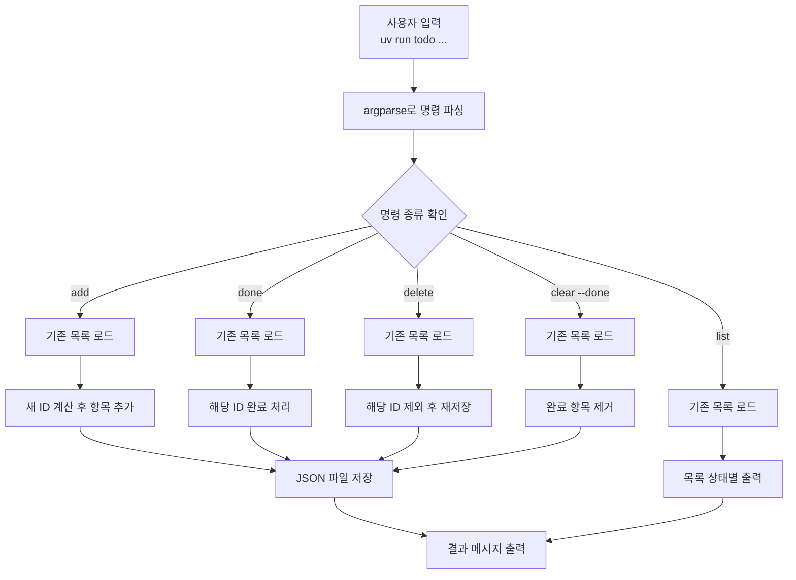
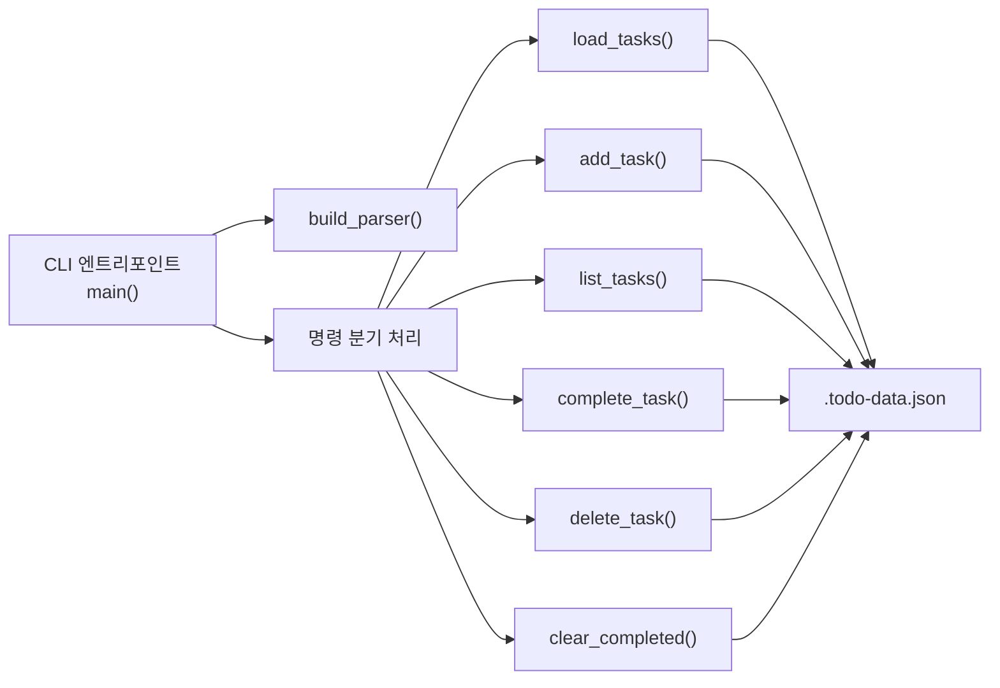
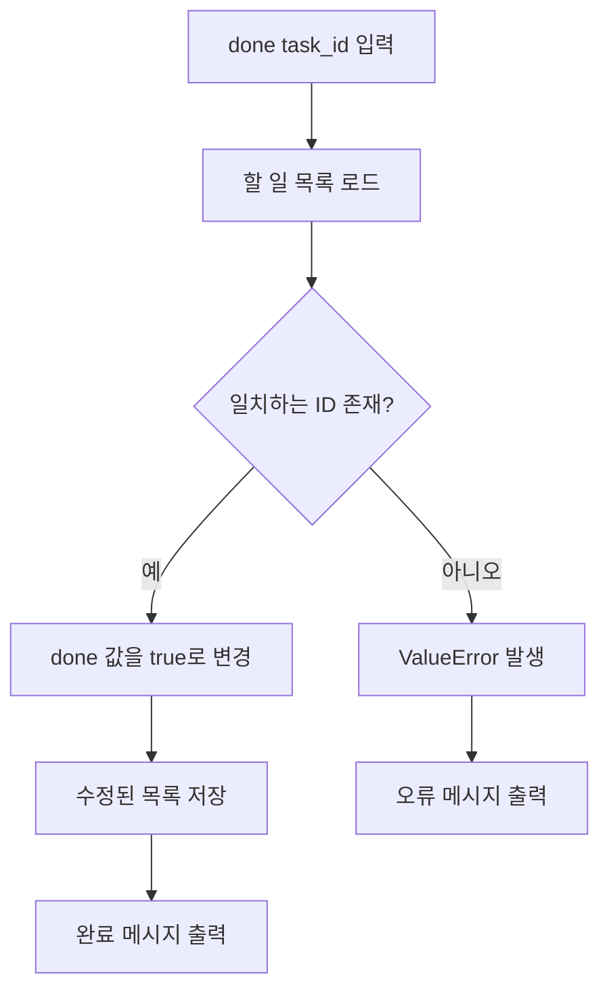

# Python TODO

`uv`로 실행하는 간단한 CLI TODO 프로그램입니다.

## 실행 방법

```bash
uv run todo add "장보기"
uv run todo list
uv run todo done 1
uv run todo delete 1
uv run todo clear --done
```

## 지원 기능

- 할 일 추가
- 할 일 목록 조회
- 할 일 완료 처리
- 할 일 삭제
- 완료된 항목 일괄 정리

기본 데이터 파일은 프로젝트 루트의 `.todo-data.json` 입니다.

## 알고리즘 및 로직 구조

이 프로젝트는 `CLI 입력 -> 명령 파싱 -> 파일 로드 -> 목록 처리 -> 파일 저장 -> 결과 출력` 순서로 동작합니다.

### 핵심 처리 흐름

1. 사용자가 `uv run todo ...` 명령을 입력합니다.
2. `argparse`가 하위 명령과 인자를 파싱합니다.
3. 필요한 경우 `.todo-data.json` 파일에서 기존 할 일 목록을 읽습니다.
4. 명령에 따라 추가, 조회, 완료, 삭제, 정리 로직을 수행합니다.
5. 데이터가 바뀐 경우 JSON 파일에 다시 저장합니다.
6. 처리 결과를 콘솔에 출력합니다.

### 데이터 구조

각 할 일은 아래 형태의 딕셔너리로 저장됩니다.

```json
{
  "id": 1,
  "title": "장보기",
  "done": false
}
```

- `id`: 할 일을 구분하는 고유 번호
- `title`: 할 일 제목
- `done`: 완료 여부

### 명령별 로직

- `add`: 현재 목록에서 가장 큰 `id`를 찾아 `+1` 한 뒤 새 할 일을 저장합니다.
- `list`: 저장된 목록을 그대로 읽어 상태와 함께 출력합니다.
- `done`: `id`가 일치하는 항목을 순차 탐색해 `done = true`로 변경합니다.
- `delete`: 삭제 대상만 제외한 새 리스트를 만들어 저장합니다.
- `clear --done`: 완료되지 않은 항목만 남기고 완료 항목을 한 번에 제거합니다.

## Mermaid 도식화

### 전체 실행 흐름



### 데이터 처리 구조



### `done` 명령 상세 흐름


